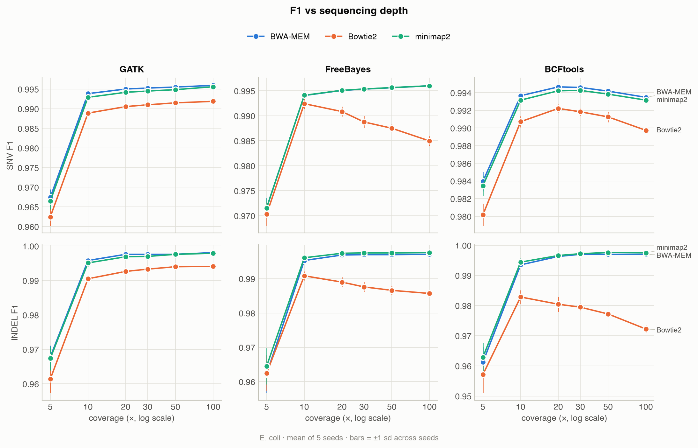
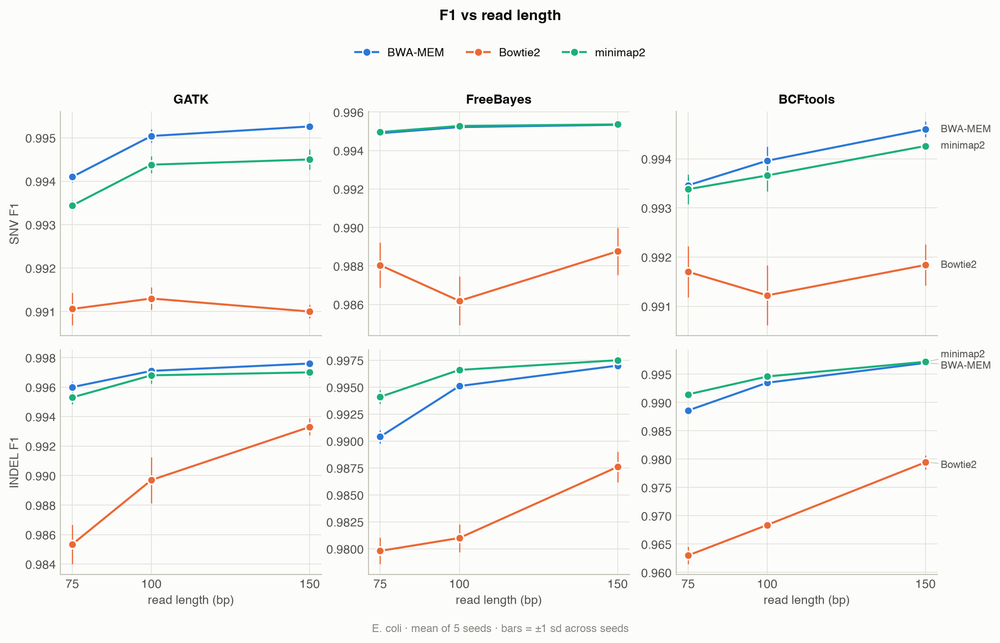
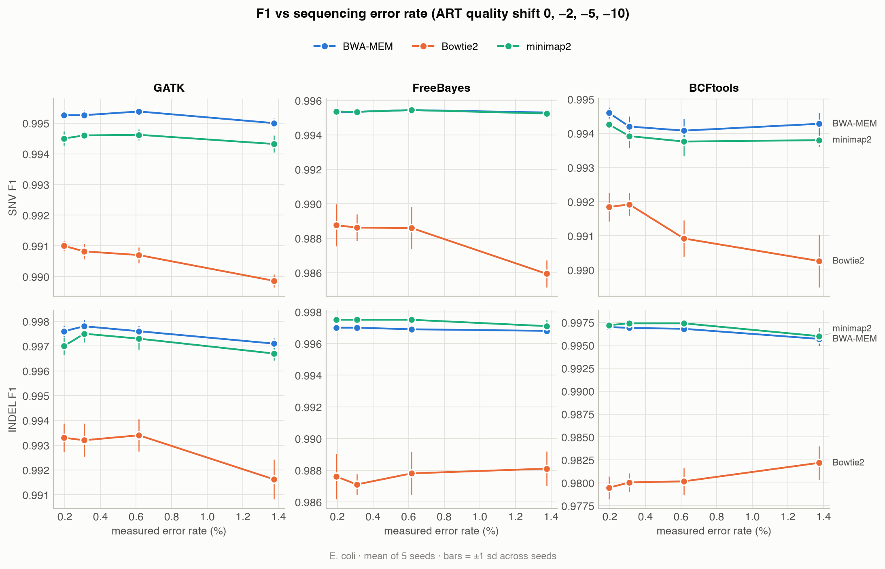
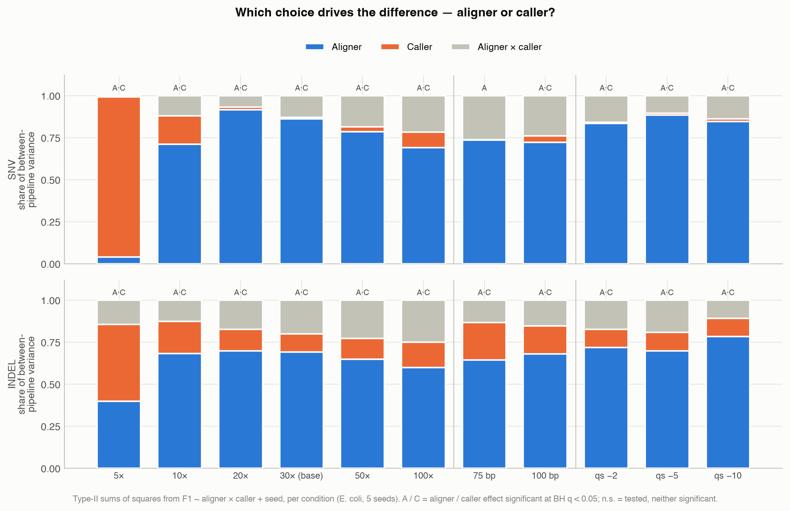
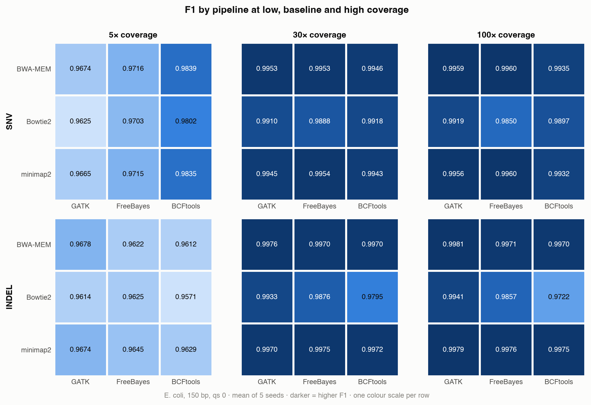
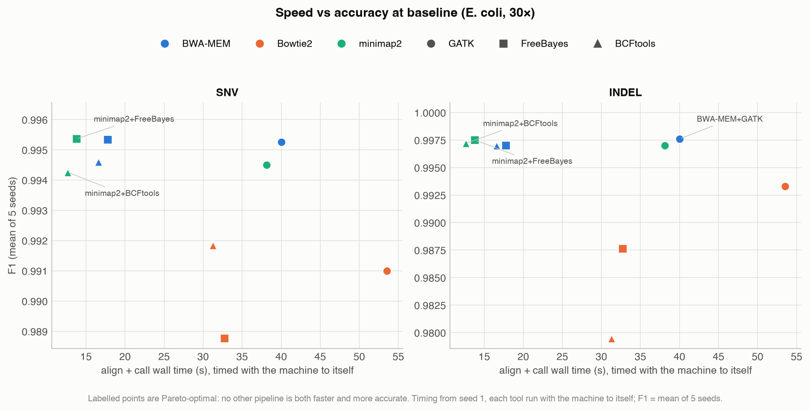
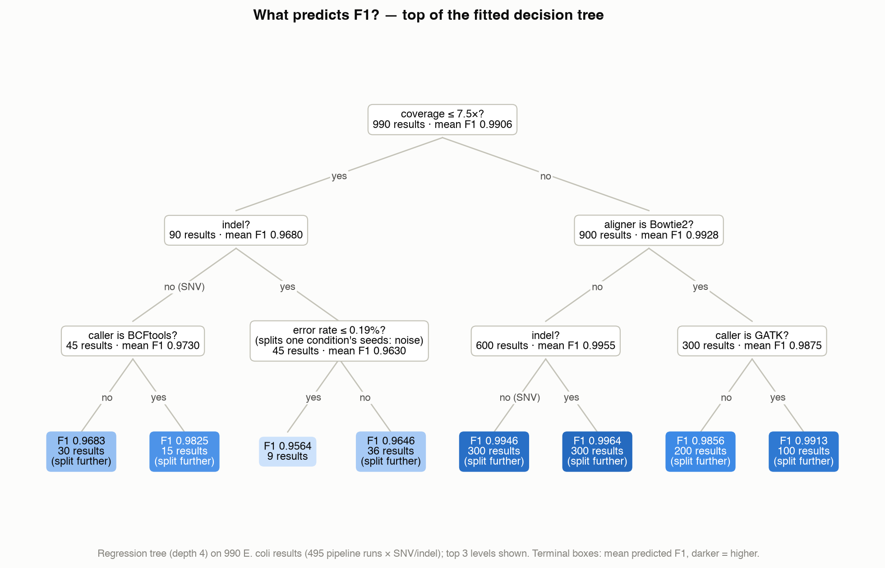

<!-- GENERATED FILE. Edit docs/report/FINAL_REPORT.template.md, then run
     `snakemake --config run=all` (or python3 scripts/build_report.py).
     Every table and every quoted number is computed from results/. -->

## 1. Introduction

Finding genetic variants from short-read sequencing data takes two tools in sequence. An
**aligner** decides where in the genome each read came from; a **variant caller** then examines
the reads stacked over each position and decides whether the sample genuinely differs from the
reference or whether the apparent difference is sequencing error. Many aligners and callers are in
wide use. In practice the combination a laboratory runs is usually chosen by habit, or by whatever
a tutorial used, rather than by evidence. For bacterial genomics the stakes are concrete:
outbreak investigations separate related isolates by a handful of single-nucleotide differences, so
a pipeline that adds or loses a few dozen SNVs can change the conclusion.

This project asks two questions:

1. **Which aligner–caller combination is most accurate, and how much does the choice matter?**
2. **Does the answer depend on the data** — on sequencing depth, read length and error rate — and
   can the best pipeline be predicted from those properties?

A secondary aim, which shaped much of the work, was to make the benchmark itself trustworthy.
Benchmarks of this kind can fail in ways that produce confident, plausible and wrong numbers with
no error message at all; three such failure modes were found and controlled (§2.6).

Benchmarking against a real sample is impossible, because its correct variant list is unknown. We
follow the established alternative of simulating data whose truth is known by construction
[1, 13], and score with the Global Alliance for Genomics and Health (GA4GH) benchmarking standard
[2]. This report covers Phase 1 of the project: simulated reads on haploid genomes. Validation on
real sequencing data is planned for Phase 2 (§4.4).

## 2. Methods

### 2.1 Design: a sample whose answer is known by construction

To grade a variant-calling pipeline, the correct answer must be known in advance; for a real
biological sample it never is. We therefore manufacture one. A known set of SNPs and indels is
injected into a reference genome with simuG [4], producing a mutated genome and a truth VCF
recording every edit in **reference coordinates**. Paired-end reads are simulated **from the
mutated genome** with ART [5] and aligned **to the original reference**; each pipeline's call set
is then scored against the injected truth. Inverting that direction makes every pipeline report
zero variants, and was guarded against explicitly in code.

### 2.2 Genomes and truth sets

Two haploid genomes were used: bacteriophage phiX174 (RefSeq `NC_001422.1`, 5,386 bp) and
*Escherichia coli* K-12 MG1655 (`NC_000913.3`, 4,641,652 bp). phiX is a fast end-to-end smoke
test; *E. coli* is large enough, and repetitive enough, to separate the pipelines. Contig names
were normalised once at download so that the reference, truth set, confident-region BED, all
indexes and all call sets agree; a mismatch does not raise an error, it silently yields precision
and recall of zero.

simuG injected 50 SNVs + 10 indels into phiX and 5,000 SNVs + 1,000 indels into *E. coli*
(seed 20260814), with a transition/transversion ratio of 2.0 (measured: 2.04 for *E. coli*),
close to real bacterial divergence. Indel lengths follow simuG's power-law default (1–50 bp).
Each truth set was verified three ways: record counts; the reference base at sampled positions
(`samtools faidx`); and a length-bookkeeping check that the net indel length in the VCF equals the
mutated genome's actual size difference (+14 bp phiX, +187 bp *E. coli*), which ties the truth
file to the exact sequence the reads were drawn from. The truth set is fixed; replicate seeds
(§2.3) vary the reads, not the variants.

### 2.3 Read simulation and experimental design

Reads were simulated with ART's HiSeq 2500 error profile, paired-end, fragment length 350 ± 50 bp.
The baseline condition is **30× coverage, 150 bp reads, quality shift 0**. A one-factor-at-a-time
design varies each axis from the baseline while holding the others fixed:

| Axis | Levels (baseline in bold) |
|---|---|
| Coverage | 5, 10, 20, **30**, 50, 100× |
| Read length | 75, 100, **150** bp |
| ART quality shift | **0**, −2, −5, −10 |

That is 11 unique conditions per genome. Each condition was simulated with **5 independent seeds**
(replicate sequencing runs), giving 110 read sets and **990 pipeline runs**. Read length was capped
at 150 bp because the HS25 profile supports no longer reads; reaching 250 bp would require a
different instrument profile and confound read length with chemistry. ART draws sequencing errors
from the base-quality profile, so lowering the quality shift raises the error rate. Rather than use
the arbitrary `-qs` value as the error variable, the per-base error probability of every read set
was **measured** from its quality scores. This is the mean error probability, not the mean Phred
score. Phred is logarithmic, so its arithmetic mean understates the true error rate by roughly 7×
here.

### 2.4 Pipelines and fairness controls

Three aligners — BWA-MEM [6], Bowtie2 [7], minimap2 (`-ax sr`) [8] — were crossed with three
callers — GATK4 HaplotypeCaller [9], FreeBayes [10], BCFtools mpileup/call [11]. Every tool ran
with its default parameters except where fairness or correctness required otherwise:

- **Ploidy 1 in every caller.** All three default to diploid and emit heterozygous genotypes on a
  haploid genome *without error*. Ploidy was verified by reading the genotype field of every one of
  the 990 call sets — not by inspecting scores, because a caller wrongly emitting homozygous `1/1`
  genotypes scores a *perfect* F1 against haploid truth (§2.6).
- **Identical input.** All nine pipelines in a run receive byte-identical reads; no trimming.
- **Identical resources.** Every aligner and GATK received 4 threads; FreeBayes and BCFtools are
  single-threaded.
- **Identical filtering.** Raw and hard-filtered (`QUAL ≥ 20 && DP ≥ 5`) call sets were produced
  for every pipeline. Only QUAL and DP are emitted comparably by all three callers. The raw call
  sets are the primary analysis.
- **No BQSR.** GATK's base-quality recalibration needs a known-variant database, which does not
  exist for these organisms; bootstrapping one would give GATK a preprocessing step its competitors
  lack. The GATK arm is therefore deliberately not the full Best Practices pipeline.
- **Read groups** on every alignment, and duplicate marking (inert here: ART simulates no PCR
  duplicates, so ~0% are marked).

### 2.5 Scoring

Every call set and the truth set were normalised with identical arguments
(`bcftools norm -f ref -m -any --atomize`), then compared with `rtg vcfeval` [3], the GA4GH
benchmarking standard [2], which matches variants by haplotype rather than by string. Two details
proved material:

- **`--atomize` is required.** FreeBayes merges nearby variants into single complex records
  (e.g. two SNPs written as one `AAA>TAT` record). Without decomposition, separating SNVs from
  indels silently discards those records and the true variants inside them.
- **SNV and indel results are taken from a single vcfeval run.** Splitting the call set by type
  *before* scoring removes the neighbouring variants vcfeval needs to reconstruct local haplotypes,
  so correct calls near an indel are charged as both false negatives and false positives. Scores
  were therefore taken from RTG's own per-type breakdown of one full comparison; the pre-split
  method is reported for comparison (§3.8).

Precision, recall and F1 = 2TP/(2TP + FP + FN) are reported for SNVs and indels separately.

### 2.6 Correctness controls

Three failure modes were identified in which the benchmark would have produced plausible but wrong
numbers with no error message:

| Failure mode | What it would have shown | Control |
|---|---|---|
| Diploid genotypes on a haploid genome | Nothing — and `1/1` scores a perfect F1 | Genotype field read from every call set |
| Simulator truth in mutated-genome coordinates vs alignments in reference coordinates | Placement accuracy 8.9% instead of 99.0% | Explicit coordinate conversion, self-validated against simuG's own records |
| Complex variant records | Real calls silently dropped from per-type scores | `--atomize` on truth and calls alike |

A negative control confirmed that scoring discriminates. Corrupting a perfect phiX call set by
shifting every position 5 bp gave F1 = 0.0000. Replacing every SNV allele gave 0.1667, because
only the untouched indels survive. Removing half the calls gave recall of exactly 0.500.

### 2.7 Alignment and runtime measurement

**Placement accuracy** — the fraction of reads an aligner places within ±10 bp of their true origin
— isolates the aligner from the caller. ART records each read's origin in mutated-genome
coordinates; these were converted to reference coordinates before comparison.

**Runtime and peak memory** were measured with `/usr/bin/time` around each tool alone (kernel-exact
peak resident memory) on one machine (Apple M4, 10 cores, 24 GB RAM, macOS; all tools native
arm64 builds). For seed 1 of every condition, each timed tool ran with the machine to itself so
that measurements were free of contention. Timings from seeds 2–5, made while other jobs ran, were
recorded but excluded from runtime analysis.

### 2.8 Error-mechanism tests

Three error patterns that emerged from the sweep were tested against a specific, falsifiable
explanation rather than left as interpretation (`scripts/diagnose_errors.py`):

- **False SNVs beside true indels.** For every false-positive SNV, the distance to the nearest
  *true* indel was computed and compared with the fraction of the genome lying within 150 bp
  (one read length) of a true indel.
- **Missed variants in repeats.** For every missed variant, the fraction of covering reads with
  mapping quality (MAPQ) ≥ 20 was computed from the alignment, and compared with the same
  statistic over all true variant sites.
- **phiX errors.** Every phiX error outside 5× coverage was listed by position, caller and seed.

### 2.9 Statistical analysis

Within a condition, all nine pipelines analyse the same reads for a given seed, so seed is a
**blocking factor**: a randomised complete block design with a 3 × 3 factorial treatment. For each
condition and variant type we fitted the two-way ANOVA

> F1 ~ aligner × caller + seed

with type-II sums of squares, testing the aligner, caller and interaction effects against
seed-to-seed residual variation. Effect size is reported as each factor's **share of the
between-pipeline sum of squares** and as partial η². Because F1 near 1.0 is bounded and skewed,
a rank-based Friedman test across the nine pipelines (seeds as blocks) was run as a robustness
check. P-values were corrected with the Benjamini–Hochberg procedure across the 11 conditions
within each genome × variant-type family.

### 2.10 Predictive model

To predict which pipeline wins under which conditions, a regression tree (depth 4, minimum leaf
size 5; settings fixed before fitting) was fitted to *E. coli* F1 with features coverage, read
length, measured error rate, variant type, aligner and caller. A random forest (400 trees) was
fitted to compare accuracy and to estimate permutation importances. phiX was excluded because it
saturates at F1 = 1.0. The decision metric is **selection regret**, the F1 lost by choosing the
model's top-ranked pipeline instead of the true best. It is compared with the trivial rule "always
choose the training set's best-on-average pipeline" and with a random choice. A tree predicts one
value per leaf, so it often ranks several pipelines equal. It is then indifferent between them, and
its regret is scored as the *expected* regret of choosing among the tied pipelines at random. An
earlier version broke such ties by alphabetical order, which credited or blamed the tree for
choices it never made.

Two validations were used. **Held-out seeds** trains on seeds 1–3 and tests on seeds 4–5. The split
is by seed, never by row, because rows sharing a seed share reads. **Leave-one-condition-out**
tests generalisation to an unseen condition and, at the ends of each axis, requires extrapolation.

### 2.11 Reproducibility

The full study is a Snakemake [12] workflow with per-rule pinned conda environments. One command
reproduces it (`snakemake --config run=all`; about 2.5 hours on the machine above), and
`scripts/verify_all.sh` audits the outputs against the project's definition of done, re-deriving
each fact from the data rather than checking that files exist. Every table in this report, and
every number in its text, is generated from the results files by `scripts/build_report.py`
(Appendix B).

## 3. Results

### 3.1 At baseline every pipeline is accurate, but they are not equal

Tables 1 and 2 give *E. coli* F1 at the baseline condition (30×, 150 bp, mean ± sd over 5 seeds).

**Table 1. SNV F1, *E. coli*, 30×, 150 bp.**

|  | GATK | FreeBayes | BCFtools |
|--------------|---------------|---------------|---------------|
| **BWA-MEM** | 0.9953 ± 0.0001 | 0.9953 ± 0.0002 | 0.9946 ± 0.0002 |
| **Bowtie2** | 0.9910 ± 0.0002 | 0.9888 ± 0.0012 | 0.9918 ± 0.0004 |
| **minimap2** | 0.9945 ± 0.0002 | 0.9954 ± 0.0002 | 0.9943 ± 0.0001 |

**Table 2. Indel F1, *E. coli*, 30×, 150 bp.**

|  | GATK | FreeBayes | BCFtools |
|--------------|---------------|---------------|---------------|
| **BWA-MEM** | 0.9976 ± 0.0002 | 0.9970 ± 0.0000 | 0.9970 ± 0.0000 |
| **Bowtie2** | 0.9933 ± 0.0006 | 0.9876 ± 0.0014 | 0.9795 ± 0.0013 |
| **minimap2** | 0.9970 ± 0.0004 | 0.9975 ± 0.0000 | 0.9972 ± 0.0003 |

All nine pipelines exceed F1 = 0.979, and the BWA-MEM and minimap2 pipelines lie within 0.001 of
each other. Bowtie2 is the outlier: with every caller, and for SNVs and indels alike, it gives the lowest F1. Seed-to-seed standard deviations are small (median 0.00045 for
SNVs, 0.00080 for indels), so differences of a few thousandths are real, not noise.
In absolute terms the best SNV pipelines make about 47 errors among 5,000 true SNVs, almost all of
them misses. Bowtie2 + FreeBayes makes about 112, more than half of them false calls (§3.4).

### 3.2 Depth matters most; error rate hardly at all



**Depth** (Figure 1) is the dominant variable. At 5× every pipeline loses accuracy (SNV F1
0.962–0.984, indel 0.957–0.968), mostly through
missed variants. Most of that is recovered by 10×, and gains flatten above 20×. Beyond 20× the
pipelines diverge in direction. With BWA-MEM or minimap2, GATK and FreeBayes keep improving slowly
to 100×. BCFtools peaks at 20–30× and then declines slightly with every aligner, and Bowtie2 with
FreeBayes or BCFtools declines steeply. Both declines are caused by false positives that
accumulate with depth (§3.4). No pipeline reaches F1 = 1: about 40–50 *E. coli* SNVs are missed
even at 100× by the best pipelines, and §3.4 shows why.



**Read length** (Figure 2) matters mainly for indels. At 75 bp, indel F1 falls for every pipeline,
most for BCFtools and FreeBayes (BWA-MEM + BCFtools from 0.9970 to 0.9886; Bowtie2 + BCFtools from
0.9795 to 0.9630) and least for GATK (BWA-MEM + GATK from 0.9976 to 0.9960). A short read that
overlaps an indel has few flanking bases to anchor it, and GATK's local reassembly recovers more of
these. SNV F1 changes by at most 0.003.



**Error rate** (Figure 3) has almost no effect. The measured per-base error rose from
0.19% to 1.37%, 7-fold, yet F1 moved by at most 0.003 in either
direction for any pipeline. At 30× each position is covered by about 30 reads, and independent
random errors rarely agree on the same wrong base at the same position, so every caller separates
them from true variants easily. The errors that matter in this benchmark are *systematic* ones
from alignment, which repeat across reads.

### 3.3 The aligner matters more than the caller

**Table 3. Two-way ANOVA (blocked by seed) across the 11 *E. coli* conditions.** "Share" is the
factor's fraction of the between-pipeline sum of squares; significance is BH-adjusted q < 0.05.

| Variant type | Conditions tested | Aligner effect significant | Caller effect significant | Interaction significant | Aligner share > caller share | Median aligner share | Median caller share | Friedman significant |
|---------|------------|-------------|-------------|-------------|---------|---------|--------|-------------|
| SNV | 11 | 11/11 | 10/11 | 11/11 | 10/11 | 0.78 | 0.02 | 11/11 |
| INDEL | 11 | 11/11 | 11/11 | 11/11 | 10/11 | 0.68 | 0.13 | 11/11 |

The nine pipelines differed significantly in every condition (Table 3; Friedman test 11/11). The
aligner effect was significant in all 11 conditions for both variant types, and the caller effect
in all but one (SNVs at 75 bp). The **aligner explained more of the between-pipeline variation than
the caller in 10 of 11 conditions** for both variant types. The median shares were
0.78 vs 0.02 for SNVs and 0.68 vs
0.13 for indels. The typical aligner spread in SNV F1 (0.0045) is
about ten times the seed-to-seed standard deviation (0.00045). The interaction was also
significant everywhere (median share 0.14 for SNVs): how much the aligner matters
depends on the caller, mainly because GATK absorbs most of Bowtie2's penalty (§3.4). Appendix A
gives the full per-condition results.



**The exception is 5× coverage** (Figures 4 and 5). There the caller explains most of the SNV
variation and the ranking changes. BWA-MEM + BCFtools is the most accurate SNV pipeline at 5×,
while GATK, best or joint-best at higher depth, is the worst caller for SNVs. With only about five reads per site,
BCFtools calls variants on less evidence. At 5×, BWA-MEM + BCFtools averaged 122 missed SNVs and 37
false ones per run; BWA-MEM + FreeBayes missed 276 with almost no false calls. At low depth that
trade favours sensitivity.



### 3.4 Why the pipelines differ: three error mechanisms

**Bowtie2 places reads correctly.** Table 4 shows that placement accuracy, the purest measure of an
aligner, is almost identical for the three aligners: 98.8–99.0% of reads within ±10 bp, with the
aligners never more than 0.1 percentage points apart in any condition or seed. Mapping rates are also near 100%. (Bowtie2's MAPQ scale tops out at 42 rather than 60,
so mean MAPQ is not comparable across aligners.) Bowtie2's deficit therefore comes not from *where*
it puts reads but from *how* it aligns them.

**Table 4. Alignment metrics, *E. coli*, seed 1.**

| Condition | Aligner | Placement ±10 bp | Mapping rate | Mean MAPQ | MAPQ0 reads | Mean depth |
|--------------|----------|-----------|----------|------|--------|-------|
| 5× | BWA-MEM | 99.004% | 100.000% | 59.0 | 1.293% | 5.0 |
| 5× | Bowtie2 | 98.985% | 99.980% | 41.2 | 0.021% | 5.0 |
| 5× | minimap2 | 99.011% | 100.000% | 59.1 | 1.293% | 5.0 |
| 30× (baseline) | BWA-MEM | 99.020% | 100.000% | 59.1 | 1.283% | 30.0 |
| 30× (baseline) | Bowtie2 | 99.006% | 99.981% | 41.2 | 0.020% | 30.0 |
| 30× (baseline) | minimap2 | 99.025% | 100.000% | 59.1 | 1.284% | 30.0 |
| 100× | BWA-MEM | 99.021% | 100.000% | 59.1 | 1.286% | 99.9 |
| 100× | Bowtie2 | 99.005% | 99.980% | 41.2 | 0.020% | 99.9 |
| 100× | minimap2 | 99.022% | 100.000% | 59.1 | 1.287% | 99.9 |
| 75 bp reads | BWA-MEM | 98.879% | 100.000% | 58.9 | 1.483% | 30.0 |
| 75 bp reads | Bowtie2 | 98.843% | 99.967% | 41.1 | 0.033% | 30.0 |
| 75 bp reads | minimap2 | 98.841% | 99.980% | 58.7 | 1.531% | 30.0 |
| qs −10 | BWA-MEM | 99.016% | 100.000% | 59.1 | 1.293% | 30.0 |
| qs −10 | Bowtie2 | 98.990% | 99.973% | 41.1 | 0.028% | 30.0 |
| qs −10 | minimap2 | 99.003% | 99.995% | 59.0 | 1.300% | 30.0 |

**Mechanism 1: false SNVs beside true indels.** Bowtie2 aligns reads end to end by default: every
base of the read must be aligned, with no soft-clipping. When a read ends just past a true indel,
the cheapest end-to-end alignment often writes the overhang as a run of mismatches instead of
opening a gap. Each such read contributes an apparent substitution next to the indel. As depth
rises, more reads end near each indel, and the apparent substitutions eventually pass the caller's
threshold. The prediction is that Bowtie2's false SNVs should sit beside true indels and grow with
depth. Table 5 confirms both. At 100×, Bowtie2 + FreeBayes made 137 false SNVs, 99% of them within
150 bp of a true indel (median distance 12 bp), although only 6.3% of the genome lies that close
to one. BWA-MEM and minimap2 soft-clip such overhangs, and with FreeBayes or GATK they made almost no
false SNVs from 10× upward (at most one per run on average, in any condition). GATK HaplotypeCaller reassembles the reads in each active
region into candidate haplotypes. It recovers the indel and discards the spurious mismatches, so
Bowtie2 + GATK also makes almost none (at most two per run on average). This is the interaction found in §3.3.

**Table 5. False-positive SNVs and their distance to the nearest true indel, by depth.**

| Coverage | Bowtie2 + FreeBayes | Bowtie2 + BCFtools | BWA-MEM + BCFtools | minimap2 + BCFtools | Other 5 pipelines (total) |
|----------|------------------|------------------|------------------|------------------|-----------|
| 5× | 24 (42%, 457.5 bp) | 46 (26%, 871.5 bp) | 36 (6%, 1483.5 bp) | 36 (6%, 1483.5 bp) | 5 |
| 10× | 26 (77%, 28.5 bp) | 3 (100%, 4 bp) | 1 (100%, 0 bp) | 1 (100%, 0 bp) | 0 |
| 20× | 45 (100%, 10 bp) | 5 (100%, 20 bp) | 1 (100%, 1 bp) | 1 (100%, 1 bp) | 0 |
| 30× | 75 (99%, 20 bp) | 9 (100%, 1 bp) | 5 (100%, 1 bp) | 5 (100%, 1 bp) | 0 |
| 50× | 86 (99%, 15 bp) | 22 (100%, 2 bp) | 14 (100%, 1 bp) | 14 (100%, 1 bp) | 0 |
| 100× | 137 (99%, 12 bp) | 32 (100%, 2 bp) | 21 (100%, 1 bp) | 21 (100%, 1 bp) | 0 |

Cells: false-positive SNVs (share within 150 bp of a true indel, median distance to it). E. coli, seed 1. For comparison, 6.3% of the genome lies within 150 bp of a true indel.

At 5× (first row of Table 5) the false calls are of a different kind. They lie no closer to
indels than chance would predict. They are calls made on thin evidence, where a sequencing error
carried by one or two of the five reads at a site looks like a variant.

**Mechanism 2: BCFtools' milder version, with every aligner.** BCFtools also accumulates false
SNVs with depth, from about 5 at 30× to 21 at 100× with BWA-MEM or minimap2. These sit a median of
1 bp from a true indel (Table 5). This is why BCFtools' SNV F1 peaks at 20–30× and then declines
with every aligner (Figure 1).

**Mechanism 3: missed variants in repeats.** The roughly 50 variants that even the best pipelines
miss at 100× are not random. Table 6 shows that 96–100% of the missed variants of every BWA-MEM and
minimap2 pipeline lie at sites where most covering reads have MAPQ < 20. Such reads could have come
from more than one place in the genome. Only 1.4–2.3% of all true variant sites look like this.
These sites are repeated sequence (*E. coli* K-12 carries, for example, seven near-identical
ribosomal RNA operons and several insertion-sequence families), and no amount of depth resolves
them. Bowtie2 + GATK misses roughly twice as many variants as the other GATK
pipelines (102 against 52–61 at 30×) for a combined reason. Bowtie2 assigns low MAPQ at more
true-variant sites (2.3% against 1.4–1.5%), and GATK by default ignores reads with MAPQ < 20,
while FreeBayes's default threshold is 1 and BCFtools' is 0.

**Table 6. Missed variants (all types) and mappability, *E. coli*, seed 1.**

| Pipeline | Missed at 30× | …of which in low-MAPQ sites (30×) | Missed at 100× | …of which in low-MAPQ sites (100×) |
|--------------------|--------|----------|--------|----------|
| BWA-MEM + GATK | 52 | 98% | 47 | 100% |
| BWA-MEM + FreeBayes | 53 | 96% | 49 | 96% |
| BWA-MEM + BCFtools | 54 | 96% | 51 | 96% |
| Bowtie2 + GATK | 102 | 100% | 94 | 100% |
| Bowtie2 + FreeBayes | 60 | 85% | 56 | 84% |
| Bowtie2 + BCFtools | 88 | 90% | 89 | 90% |
| minimap2 + GATK | 61 | 98% | 50 | 100% |
| minimap2 + FreeBayes | 52 | 98% | 48 | 98% |
| minimap2 + BCFtools | 59 | 100% | 53 | 100% |

Low-MAPQ site: fewer than half of the reads covering it have mapping quality ≥ 20. Share of ALL true variant sites that are low-MAPQ (30×): BWA-MEM 1.4%, Bowtie2 2.3%, minimap2 1.5%. E. coli, seed 1, all variant types.

### 3.5 Speed and memory

**Table 7. Wall time per tool against depth (*E. coli*, 150 bp, seed 1, machine to itself), and
peak memory at 30×.**

| Coverage | BWA-MEM (s) | Bowtie2 (s) | minimap2 (s) | GATK (s) | FreeBayes (s) | BCFtools (s) |
|----------|---------|---------|----------|------|-----------|----------|
| 5× | 1.0 | 3.2 | 0.5 | 15.9 | 2.8 | 4.6 |
| 10× | 2.0 | 6.8 | 0.9 | 18.3 | 4.4 | 5.8 |
| 20× | 3.6 | 14.1 | 1.5 | 24.9 | 7.7 | 7.7 |
| 30× | 6.1 | 20.8 | 2.1 | 34.2 | 11.7 | 10.5 |
| 50× | 10.3 | 33.4 | 3.1 | 47.3 | 16.2 | 14.2 |
| 100× | 16.6 | 61.3 | 5.8 | 84.7 | 29.6 | 25.8 |

Peak memory at 30× — BWA-MEM 373 MB, Bowtie2 67 MB, minimap2 483 MB; GATK 445 MB, FreeBayes 27 MB, BCFtools 49 MB.

minimap2 is the fastest aligner, about 3× faster than BWA-MEM and 10× faster than Bowtie2 at 30×.
GATK is the slowest caller, about 3× slower than FreeBayes or BCFtools. Its 16 s at 5× is mostly
fixed cost: extrapolating its times to zero depth leaves about 11 s. At 30× every tool stays
under 0.5 GB of memory. Speed and accuracy do not trade off for SNVs: minimap2 + FreeBayes is both one of the two
fastest pipelines (about 14 s at 30×) and the most accurate (Figure 6). For indels, BWA-MEM + GATK
is the most accurate but about 3× slower (about 40 s) for a gain of under 0.001 in F1. Bowtie2 +
GATK is the slowest pipeline (about 55 s), and Bowtie2 pipelines are among the least accurate. These
absolute times are for a 4.6 Mb genome; a human genome is about 670 times larger.



### 3.6 Can the best pipeline be predicted?

**Table 8. Model validation.** Regret = mean F1 lost by choosing the model's top pipeline
instead of the true best, per decision (condition × variant type × seed).

| Validation | Model | MAE (F1) | R² | Mean regret (F1) | Decisions |
|-------------------------|------------------------------|---------|--------|---------|-----------|
| held-out seeds 4–5 | Pipeline mean (condition-blind) | 0.00499 | 0.167 | 0.00093 | 44 |
| held-out seeds 4–5 | Decision tree (depth 4) | 0.00175 | 0.880 | 0.00086 | 44 |
| held-out seeds 4–5 | Random forest | 0.00087 | 0.954 | 0.00019 | 44 |
| held-out seeds 4–5 | Always pick training-set best | — | — | 0.00093 | 44 |
| held-out seeds 4–5 | Random pick (context) | — | — | 0.00394 | 44 |
| leave-one-condition-out | Pipeline mean (condition-blind) | 0.00535 | -0.629 | 0.00095 | 110 |
| leave-one-condition-out | Decision tree (depth 4) | 0.00566 | -5.827 | 0.00087 | 110 |
| leave-one-condition-out | Random forest | 0.00521 | -5.753 | 0.00080 | 110 |
| leave-one-condition-out | Always pick training-set best | — | — | 0.00095 | 110 |
| leave-one-condition-out | Random pick (context) | — | — | 0.00388 | 110 |

**Within familiar conditions, the forest is accurate.** On held-out seeds it predicts F1 with
R² = 0.95. Its picks lose only 0.00019 F1 per decision, against 0.00093 for "always
BWA-MEM + GATK" and 0.00394 for a random choice. The interpretable tree does no better than
the fixed rule (0.00086).

**For an unseen condition, prediction largely fails.** Leave-one-condition-out R² is negative for
every model, so predicted F1 at a new condition is worse than predicting the overall mean. Holding
out 5× or 100× forces extrapolation, which trees cannot do. As a basis for *choosing* a pipeline the
models still beat chance by a wide margin: regret is 0.00080 for the forest,
0.00087 for the tree and 0.00388 for a random pick. They are only marginally
better than the fixed rule (0.00095). This is itself the main finding: above 10×, one
pipeline family is close to best everywhere and there is little left to predict. The exception is
5×, where the fixed rule loses 0.0083 per decision and the tree 0.0019.

**Table 9. Permutation importance (random forest, all *E. coli* data), grouped by factor.**

| Factor | Permutation importance (drop in R²) |
|------------------------|-------------|
| Coverage | 1.4233 |
| Aligner | 0.5031 |
| Variant type (SNV/indel) | 0.2825 |
| Caller | 0.1701 |
| Measured error rate | 0.0485 |
| Read length | 0.0124 |

Coverage is the most important feature by a wide margin, followed by the aligner, the variant type
and the caller (Table 9), the same ordering as the ANOVA. The small importances of error rate and
read length should not be compared with each other. In this one-factor-at-a-time design they are
partly confounded: the 75 bp reads also have the lowest measured error (0.145% against 0.195%),
because ART's error rises along the read.



The tree (Figure 7) reads as a simple policy. Its first question is whether coverage is at most
7.5×. At low depth it prefers BCFtools for SNVs. At higher depth its next question is whether the
aligner is Bowtie2, and within Bowtie2 it prefers GATK. One split, "error rate ≤ 0.19%" under 5×
indels, separates the replicate seeds of a single condition, whose measured error rates differ by about
0.5%. It fits noise, and it is labelled as such in the figure rather than
removed by re-tuning the tree after seeing it.

**Table 10. Best pipeline per condition against the tree's recommendation.** Because a tree leaf
predicts one value for several pipelines, the tree recommends a *set*.

| Condition | Type | Actual best (mean F1) | Tree's top-ranked set (mean F1) | Worst (mean F1) |
|--------------|-------|-----------------------------|------------------------------|----------------------------|
| 5× | INDEL | BWA-MEM + GATK (0.9678) | all 9 tied (no preference) (0.9630) | Bowtie2 + BCFtools (0.9571) |
| 5× | SNV | BWA-MEM + BCFtools (0.9839) | BWA-MEM/minimap2 + BCFtools (2 tied) (0.9837) | Bowtie2 + GATK (0.9625) |
| 10× | INDEL | minimap2 + FreeBayes (0.9961) | BWA-MEM/minimap2 + any caller (6 tied) (0.9950) | Bowtie2 + BCFtools (0.9828) |
| 10× | SNV | minimap2 + FreeBayes (0.9941) | BWA-MEM/minimap2 + GATK/FreeBayes (4 tied) (0.9937) | Bowtie2 + GATK (0.9889) |
| 20× | INDEL | BWA-MEM + GATK (0.9976) | BWA-MEM/minimap2 + any caller (6 tied) (0.9970) | Bowtie2 + BCFtools (0.9804) |
| 20× | SNV | minimap2 + FreeBayes (0.9951) | BWA-MEM/minimap2 + GATK/FreeBayes (4 tied) (0.9948) | Bowtie2 + GATK (0.9905) |
| 75 bp reads | INDEL | BWA-MEM + GATK (0.9960) | BWA-MEM/minimap2 + any caller (6 tied) (0.9926) | Bowtie2 + BCFtools (0.9630) |
| 75 bp reads | SNV | minimap2 + FreeBayes (0.9950) | BWA-MEM/minimap2 + GATK/FreeBayes (4 tied) (0.9943) | Bowtie2 + FreeBayes (0.9880) |
| 100 bp reads | INDEL | BWA-MEM + GATK (0.9971) | BWA-MEM/minimap2 + any caller (6 tied) (0.9956) | Bowtie2 + BCFtools (0.9684) |
| 100 bp reads | SNV | minimap2 + FreeBayes (0.9953) | BWA-MEM/minimap2 + GATK/FreeBayes (4 tied) (0.9950) | Bowtie2 + FreeBayes (0.9862) |
| qs −10 | INDEL | BWA-MEM + GATK (0.9971) | BWA-MEM/minimap2 + any caller (6 tied) (0.9966) | Bowtie2 + BCFtools (0.9822) |
| qs −10 | SNV | BWA-MEM + FreeBayes (0.9953) | BWA-MEM/minimap2 + GATK/FreeBayes (4 tied) (0.9950) | Bowtie2 + FreeBayes (0.9859) |
| qs −5 | INDEL | BWA-MEM + GATK (0.9976) | BWA-MEM/minimap2 + any caller (6 tied) (0.9972) | Bowtie2 + BCFtools (0.9802) |
| qs −5 | SNV | BWA-MEM + FreeBayes (0.9954) | BWA-MEM/minimap2 + GATK/FreeBayes (4 tied) (0.9952) | Bowtie2 + FreeBayes (0.9886) |
| qs −2 | INDEL | BWA-MEM + GATK (0.9978) | BWA-MEM/minimap2 + any caller (6 tied) (0.9973) | Bowtie2 + BCFtools (0.9800) |
| qs −2 | SNV | BWA-MEM + FreeBayes (0.9953) | BWA-MEM/minimap2 + GATK/FreeBayes (4 tied) (0.9951) | Bowtie2 + FreeBayes (0.9886) |
| baseline (30×) | INDEL | BWA-MEM + GATK (0.9976) | BWA-MEM/minimap2 + any caller (6 tied) (0.9972) | Bowtie2 + BCFtools (0.9795) |
| baseline (30×) | SNV | minimap2 + FreeBayes (0.9954) | BWA-MEM/minimap2 + GATK/FreeBayes (4 tied) (0.9951) | Bowtie2 + FreeBayes (0.9888) |
| 50× | INDEL | BWA-MEM + GATK (0.9976) | BWA-MEM/minimap2 + any caller (6 tied) (0.9974) | Bowtie2 + BCFtools (0.9772) |
| 50× | SNV | minimap2 + FreeBayes (0.9956) | BWA-MEM/minimap2 + GATK/FreeBayes (4 tied) (0.9954) | Bowtie2 + FreeBayes (0.9875) |
| 100× | INDEL | BWA-MEM + GATK (0.9981) | BWA-MEM/minimap2 + any caller (6 tied) (0.9975) | Bowtie2 + BCFtools (0.9722) |
| 100× | SNV | BWA-MEM + FreeBayes (0.9960) | BWA-MEM/minimap2 + GATK/FreeBayes (4 tied) (0.9959) | Bowtie2 + FreeBayes (0.9850) |

The actual best pipeline is inside the tree's recommended set in 22/22 cases
(Table 10), but the sets are broad, from 2 to all 9 pipelines. The tree cannot separate the top
few, whose true differences (under 0.001 in F1) are close to seed-level noise.

### 3.7 phiX174: near-perfect, with explainable exceptions

**Table 11. phiX174: pipeline × variant-type cells that are perfect (F1 = 1) on all five seeds.**

| Condition | Pipeline × type cells perfect on all 5 seeds | Lowest F1 (any seed) |
|--------------|----------|--------|
| 5× | 0/18 | 0.9130 |
| 10× | 12/18 | 0.9899 |
| 20× | 9/18 | 0.9524 |
| baseline (30×) | 16/18 | 0.9901 |
| 50× | 16/18 | 0.9901 |
| 100× | 16/18 | 0.9901 |
| 75 bp reads | 18/18 | 1.0000 |
| 100 bp reads | 18/18 | 1.0000 |
| qs −2 | 9/18 | 0.9899 |
| qs −5 | 15/18 | 0.9901 |
| qs −10 | 18/18 | 1.0000 |

phiX is too small to separate the pipelines, but it is a sensitive check that nothing is broken.
At 5× misses are expected. Table 12 lists every error in the other 450 phiX runs.

**Table 12. Every phiX error outside 5× coverage.**

| Error | Position | Change | Runs affected | Callers | Seeds | Highest QUAL |
|---------------|----------|-------------|----------|-------------------------|-------|---------|
| missed (FN) | 51 | A → T | 27 / 450 | BCFtools, FreeBayes, GATK | 3,4,5 | — |
| false call (FP) | 1703 | C → T | 3 / 450 | BCFtools | 3 | 5 |
| false call (FP) | 2470 | G → C | 2 / 450 | BCFtools | 5 | 4 |
| false call (FP) | 2615 | C → T | 8 / 450 | BCFtools | 4 | 9 |
| false call (FP) | 2903 | G → GATCGAGCA | 1 / 450 | BCFtools | 2 | 225 |

Each error has a specific cause.

- **Position 51 accounts for every missed variant.** phiX174 is a circular genome stored as a
  linear sequence. Reads cannot start before position 1, so depth falls steeply over the first
  read length; in the 20× run where the site was missed, it was covered by a single read.
- **Every false call comes from BCFtools.** All but one have QUAL ≤ 9 and are removed by the
  QUAL ≥ 20 filter. The repeated false SNV at 2615 sits 1 bp from a true deletion at 2614, an
  instance of Mechanism 2 (§3.4). The one high-quality false call, at 2903, is an insertion
  immediately beside a true 8 bp insertion at 2902.

The mid-semester report said all nine pipelines scored F1 = 1.0 on phiX. That was true for seed 1
at baseline. Across five seeds, 16 of the 18 baseline cells are perfect.

### 3.8 Methodological checks

**Scoring method matters at the scale of the differences being measured.** Splitting call sets by
variant type before scoring (§2.5) understated F1 by up to 0.0105 (Table 13). That is comparable
to the whole spread between pipelines. The understatement is largest for FreeBayes, which most often
reports neighbouring variants together, so a pre-split benchmark would be unfair specifically to
FreeBayes.

**Table 13. F1 understatement from pre-split scoring (single-run minus pre-split), *E. coli*.**

| Type | Caller | Mean understatement | Largest (any condition) |
|-------|-----------|----------------|------------|
| SNV | GATK | +0.0007 | +0.0008 |
| SNV | FreeBayes | +0.0023 | +0.0026 |
| SNV | BCFtools | +0.0004 | +0.0007 |
| INDEL | GATK | +0.0055 | +0.0062 |
| INDEL | FreeBayes | +0.0095 | +0.0105 |
| INDEL | BCFtools | +0.0022 | +0.0030 |

**Ti/Tv of the truth set does not change the conclusions.** The truth sets were first generated
with simuG's default Ti/Tv of 0.5 and regenerated with 2.0 after the mid-semester review, keeping
the same 5,000 SNV positions and identical indels. At baseline (seed 1) F1 changed by at most
0.0002 for BWA-MEM and minimap2 pipelines and at most 0.0024 for Bowtie2 pipelines (Table 14).

**Table 14. Baseline F1 with Ti/Tv 0.5 → 2.0 truth sets (*E. coli*, seed 1).**

| Type | Aligner | GATK | FreeBayes | BCFtools |
|-------|----------|---------------|---------------|---------------|
| SNV | BWA-MEM | 0.9953 → 0.9953 | 0.9953 → 0.9953 | 0.9948 → 0.9947 |
| SNV | Bowtie2 | 0.9909 → 0.9909 | 0.9906 → 0.9891 | 0.9914 → 0.9921 |
| SNV | minimap2 | 0.9946 → 0.9945 | 0.9953 → 0.9953 | 0.9944 → 0.9942 |
| INDEL | BWA-MEM | 0.9975 → 0.9975 | 0.9970 → 0.9970 | 0.9970 → 0.9970 |
| INDEL | Bowtie2 | 0.9935 → 0.9940 | 0.9890 → 0.9875 | 0.9815 → 0.9791 |
| INDEL | minimap2 | 0.9970 → 0.9970 | 0.9975 → 0.9975 | 0.9970 → 0.9970 |

**Generic hard filtering hurts.** The shared filter `QUAL ≥ 20 && DP ≥ 5` is catastrophic at 5×,
where DP ≥ 5 removes roughly 40% of true calls (F1 falls by 0.24–0.30). At 10× and above it
raises precision by at most 0.003 but costs more recall, lowering F1 by up to 0.0025 for every
caller (Table 15). The callers' own models already reject most false calls, so a filter that
ignores depth and caller adds little. Filters must be tuned to the caller and the expected depth.

**Table 15. Effect of the hard filter (filtered minus raw), *E. coli*, mean over seeds.**

| Type | Caller | ΔF1 at 5× | Δrecall at 5× | ΔF1, other 10 conditions | Δprecision, other 10 | Δrecall, other 10 |
|-------|-----------|---------|---------|------------|-------------|----------|
| SNV | GATK | -0.2473 | -0.3731 | -0.0024 | +0.0000 | -0.0047 |
| SNV | FreeBayes | -0.2630 | -0.3973 | -0.0012 | +0.0026 | -0.0049 |
| SNV | BCFtools | -0.2742 | -0.4253 | -0.0013 | +0.0017 | -0.0042 |
| INDEL | GATK | -0.2429 | -0.3677 | -0.0016 | +0.0000 | -0.0031 |
| INDEL | FreeBayes | -0.3005 | -0.4337 | -0.0021 | +0.0018 | -0.0059 |
| INDEL | BCFtools | -0.2679 | -0.3969 | -0.0011 | +0.0019 | -0.0040 |

## 4. Discussion

### 4.1 Answers to the two questions

**Which pipeline is most accurate, and does the choice matter?** For SNVs, BWA-MEM or minimap2
with FreeBayes or GATK. These four are within 0.001 of each other, and minimap2 + FreeBayes is
also among the fastest. For indels, BWA-MEM + GATK is best, with minimap2 + FreeBayes or GATK
close behind. The choice matters less than its statistical significance might suggest: on
simulated bacterial data every pipeline is above F1 = 0.979. But the errors are not random. A
Bowtie2-based pipeline adds up to 137 false SNVs at high depth, clustered beside indels. In
outbreak analysis, where isolates are separated by a few SNVs, that clustering is exactly the kind
of artefact that creates spurious differences. The **aligner** is the decision that matters most,
and its effect depends on the caller.

**Does the answer depend on the data, and can it be predicted?** Depth changes the answer.
Read length and error rate, over the ranges tested, barely do. Above about 10× the best pipelines
form a stable group, and a fixed choice is within a thousandth of F1 of the best everywhere. A
learned model only beats that choice clearly at low depth. The practical policy that follows is
simple:

- **Avoid Bowtie2 in its default end-to-end mode** for variant calling, or pair it only with GATK.
- **At ≥ 10×**, use BWA-MEM or minimap2 with FreeBayes or GATK for SNVs, and BWA-MEM + GATK for
  indels. Choose minimap2 + FreeBayes when speed matters.
- **At ~5×**, use BCFtools for SNVs, and do not apply a DP ≥ 5 filter.
- **Score with a single haplotype-aware comparison** and decompose complex records; otherwise
  the benchmark itself can reorder pipelines.

### 4.2 Relation to previous work

Bush *et al.* [1] benchmarked bacterial SNP-calling pipelines on simulated data and found that
accuracy depended strongly on the pipeline and on genomic divergence from the reference. Our design
is narrower: one reference per genome and a fixed divergence. In exchange it adds replicates, a
blocked statistical analysis, measured error rates, and tests of *why* pipelines fail. The
haplotype-aware scoring and decomposition follow the GA4GH recommendations [2, 3]. Our finding that
pre-split scoring is unfair to FreeBayes is a concrete example of the comparison artefacts those
recommendations were designed to avoid.

### 4.3 Limitations

- **Simulated reads are cleaner than real ones.** ART models substitution errors from quality
  profiles. It simulates no PCR duplicates, GC bias, contamination or structural variation, so
  real-data F1 will be lower and the differences between pipelines may be larger.
- **The variants are random.** simuG places variants uniformly; real variants cluster in
  hypervariable genes and mobile elements, where alignment is harder.
- **Replicates vary the reads, not the variants.** All seeds share one truth set, so variability
  across different mutation sets is not measured.
- **One-factor-at-a-time design.** Interactions between axes, such as low depth combined with
  short reads, were not tested. Read length and error rate are partly confounded, and the models
  learn only from the 11 conditions sampled.
- **One informative genome.** *E. coli* is a single species with moderate GC content; phiX
  saturates. Repeat-rich or extreme-GC genomes may rank the pipelines differently.
- **Default parameters.** Tools ran out of the box (except ploidy). Tuning, for example Bowtie2
  `--local` or GATK's MAPQ threshold, could change the ranking. The GATK arm omits BQSR and VQSR,
  and the hard-filter thresholds are generic.
- **Runtime** was measured on one laptop for a small genome; absolute times will not transfer, and
  GATK's fixed start-up cost is exaggerated relative to large genomes.

### 4.4 Future work (Phase 2)

1. **Real data:** repeat the comparison on a real *E. coli* sequencing run whose truth comes from
   an independent closed assembly, to test whether the simulated ranking holds.
2. **Independent scoring:** cross-check `vcfeval` against `hap.py` on a subset.
3. **Test Mechanism 1 directly:** rerun Bowtie2 with `--local`. If the explanation is right, its
   false SNVs beside indels should largely disappear.
4. **Factorial design at low depth** (coverage × read length × error) where the ranking changes,
   and more genomes (high GC, repeat-rich).

## 5. Conclusion

On simulated haploid genomes, all nine aligner–caller pipelines call variants accurately, but the
differences between them are systematic and explainable. The aligner matters more than the caller.
Bowtie2's end-to-end alignment creates false SNVs beside indels that grow with depth and that only
GATK's reassembly removes. Repeats set a floor of missed variants that no depth overcomes.
Sequencing depth is the only data property that changes which pipeline is best, and only at the
low end. Above 10×, BWA-MEM or minimap2 with FreeBayes or GATK is a safe default that a predictive
model barely improves on.

## References

1. Bush SJ *et al.* Genomic diversity affects the accuracy of bacterial single-nucleotide
   polymorphism–calling pipelines. *GigaScience* 9(2): giaa007 (2020).
2. Krusche P *et al.* Best practices for benchmarking germline small-variant calls in human genomes.
   *Nature Biotechnology* 37: 555–560 (2019).
3. Cleary JG *et al.* Comparing variant call files for performance benchmarking of next-generation
   sequencing variant calling pipelines. *bioRxiv* 023754 (2015). RTG Tools 3.13.
4. Yue J-X, Liti G. simuG: a general-purpose genome simulator. *Bioinformatics* 35(21): 4442–4444
   (2019).
5. Huang W *et al.* ART: a next-generation sequencing read simulator. *Bioinformatics* 28(4):
   593–594 (2012).
6. Li H. Aligning sequence reads, clone sequences and assembly contigs with BWA-MEM.
   *arXiv* 1303.3997 (2013).
7. Langmead B, Salzberg SL. Fast gapped-read alignment with Bowtie 2. *Nature Methods* 9: 357–359
   (2012).
8. Li H. Minimap2: pairwise alignment for nucleotide sequences. *Bioinformatics* 34(18): 3094–3100
   (2018).
9. Poplin R *et al.* Scaling accurate genetic variant discovery to tens of thousands of samples.
   *bioRxiv* 201178 (2018). GATK 4.6.2.0.
10. Garrison E, Marth G. Haplotype-based variant detection from short-read sequencing.
    *arXiv* 1207.3907 (2012).
11. Danecek P *et al.* Twelve years of SAMtools and BCFtools. *GigaScience* 10(2): giab008 (2021).
12. Mölder F *et al.* Sustainable data analysis with Snakemake. *F1000Research* 10: 33 (2021).
13. Zook JM *et al.* An open resource for accurately benchmarking small variant and reference calls.
    *Nature Biotechnology* 37: 561–566 (2019).

## Appendix A. Per-condition effects

**Table A1. SNV, *E. coli*.** Spreads are differences in mean F1 between the best and worst
aligner (averaged over callers) and caller (averaged over aligners); q-values are BH-adjusted.

| Condition | Best pipeline | Aligner spread | Caller spread | Seed sd | Aligner share | Caller share | q (aligner) | q (caller) |
|--------------|--------------------|---------|--------|---------|---------|--------|-----------|----------|
| 5× | BWA-MEM + BCFtools | 0.0033 | 0.0171 | 0.00187 | 0.04 | 0.95 | 2.6e-15 | 3.0e-35 |
| 10× | minimap2 + FreeBayes | 0.0032 | 0.0017 | 0.00052 | 0.71 | 0.17 | 1.8e-20 | 4.1e-11 |
| 20× | minimap2 + FreeBayes | 0.0037 | 0.0005 | 0.00042 | 0.92 | 0.01 | 9.4e-25 | 2.1e-03 |
| baseline (30×) | minimap2 + FreeBayes | 0.0045 | 0.0004 | 0.00045 | 0.86 | 0.01 | 7.5e-24 | 2.8e-02 |
| 50× | minimap2 + FreeBayes | 0.0050 | 0.0010 | 0.00036 | 0.78 | 0.03 | 7.8e-29 | 1.1e-08 |
| 100× | BWA-MEM + FreeBayes | 0.0063 | 0.0023 | 0.00039 | 0.69 | 0.09 | 5.1e-31 | 1.4e-17 |
| 75 bp reads | minimap2 + FreeBayes | 0.0039 | 0.0002 | 0.00047 | 0.74 | 0.00 | 8.3e-22 | 3.4e-01 |
| 100 bp reads | minimap2 + FreeBayes | 0.0052 | 0.0013 | 0.00051 | 0.72 | 0.04 | 5.7e-25 | 1.5e-07 |
| qs −2 | BWA-MEM + FreeBayes | 0.0045 | 0.0005 | 0.00034 | 0.83 | 0.01 | 7.3e-30 | 8.5e-04 |
| qs −5 | BWA-MEM + FreeBayes | 0.0049 | 0.0006 | 0.00050 | 0.88 | 0.01 | 1.5e-24 | 3.5e-03 |
| qs −10 | BWA-MEM + FreeBayes | 0.0062 | 0.0009 | 0.00041 | 0.85 | 0.02 | 5.1e-31 | 6.5e-07 |

**Table A2. Indel, *E. coli*.**

| Condition | Best pipeline | Aligner spread | Caller spread | Seed sd | Aligner share | Caller share | q (aligner) | q (caller) |
|--------------|--------------------|---------|--------|---------|---------|--------|-----------|----------|
| 5× | BWA-MEM + GATK | 0.0046 | 0.0051 | 0.00483 | 0.40 | 0.46 | 8.1e-08 | 1.8e-08 |
| 10× | minimap2 + FreeBayes | 0.0071 | 0.0038 | 0.00117 | 0.68 | 0.19 | 2.3e-20 | 1.8e-12 |
| 20× | BWA-MEM + GATK | 0.0096 | 0.0046 | 0.00104 | 0.70 | 0.13 | 2.7e-24 | 2.0e-13 |
| baseline (30×) | BWA-MEM + GATK | 0.0104 | 0.0047 | 0.00068 | 0.69 | 0.11 | 3.2e-30 | 7.3e-18 |
| 50× | BWA-MEM + GATK | 0.0116 | 0.0058 | 0.00055 | 0.65 | 0.12 | 2.7e-34 | 3.5e-23 |
| 100× | BWA-MEM + GATK | 0.0137 | 0.0078 | 0.00048 | 0.60 | 0.15 | 6.6e-38 | 2.2e-28 |
| 75 bp reads | BWA-MEM + GATK | 0.0176 | 0.0112 | 0.00092 | 0.64 | 0.22 | 5.9e-32 | 2.5e-24 |
| 100 bp reads | BWA-MEM + GATK | 0.0163 | 0.0090 | 0.00080 | 0.68 | 0.17 | 8.4e-34 | 4.7e-24 |
| qs −2 | BWA-MEM + GATK | 0.0107 | 0.0047 | 0.00049 | 0.72 | 0.11 | 7.2e-35 | 2.5e-22 |
| qs −5 | BWA-MEM + GATK | 0.0103 | 0.0046 | 0.00074 | 0.70 | 0.11 | 1.1e-28 | 1.7e-16 |
| qs −10 | BWA-MEM + GATK | 0.0093 | 0.0038 | 0.00088 | 0.78 | 0.11 | 5.9e-25 | 2.0e-12 |

## Appendix B. Reproducing this report

```
bash setup.sh                       # tools + conda environments (once)
snakemake --config run=all          # 990 runs, analysis, model, figures, this report
bash scripts/verify_all.sh          # audit every output against the definition of done
```

Tool versions: BWA 0.7.19, Bowtie2 2.5.5, minimap2 2.31, SAMtools 1.24, GATK 4.6.2.0,
FreeBayes 1.3.10, BCFtools 1.21, ART 2.5.8 (2016-06-05), simuG (commit 0289e58), RTG Tools 3.13,
Snakemake 9.24.0; exact builds in `envs/*.lock.yaml` and `logs/versions_latest.txt`. The master
results table is `results/results.tsv` (one row per run × pipeline × variant type × call set ×
scoring method); the design rationale for every decision is in `NOTES.md`.
